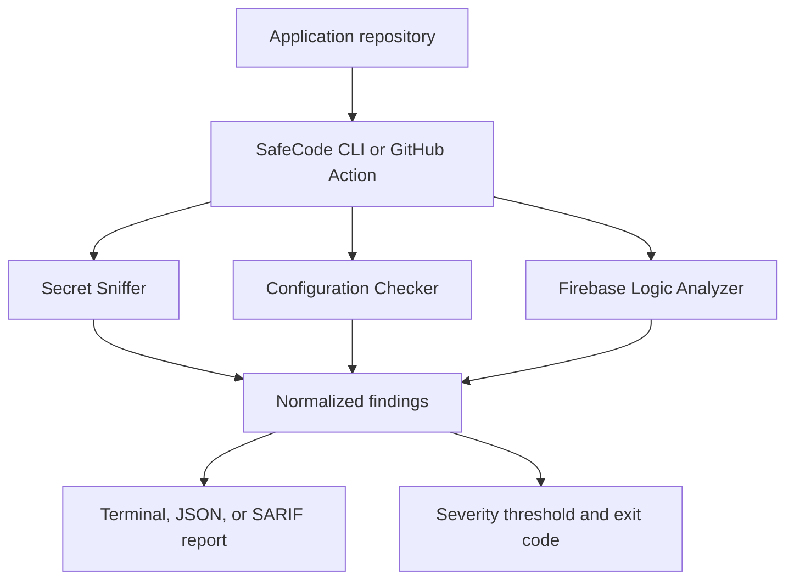
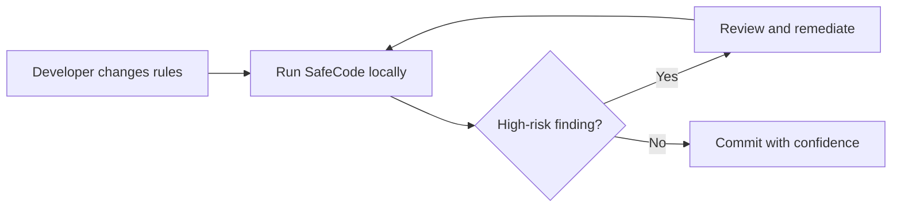
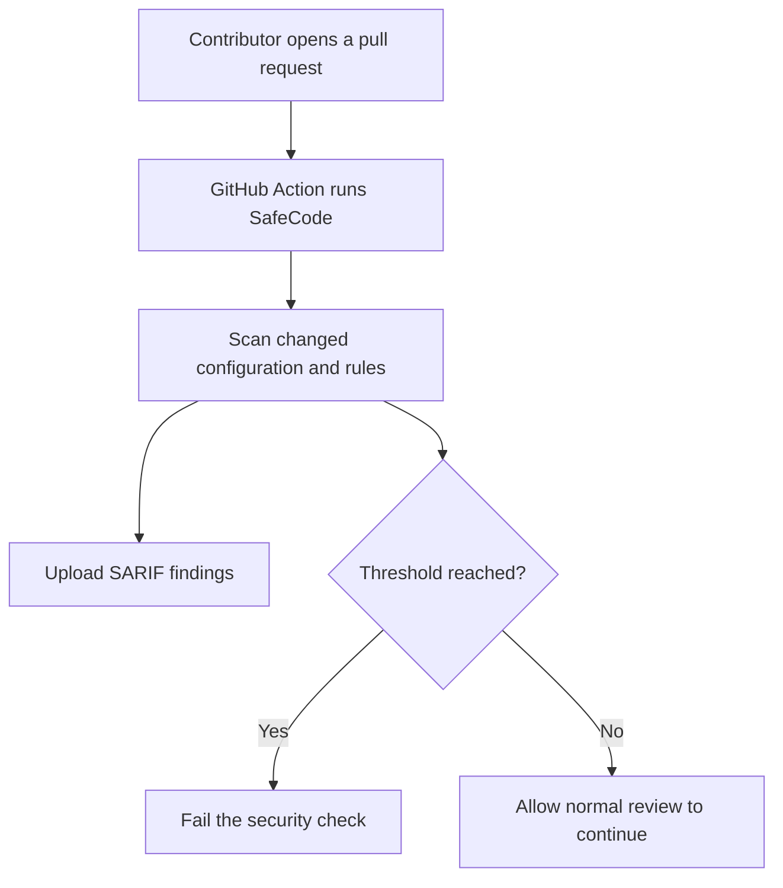
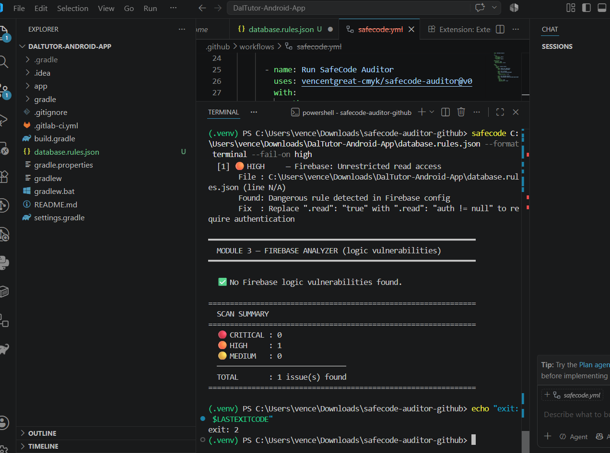

# Real-World Validation: Firebase Realtime Database

**Status:** Local validation completed on August 1, 2026  
**Scope:** An anonymized Android application using Firebase Realtime Database  
**Disclosure:** Database URLs, credentials, user data, and Firebase project identifiers are intentionally excluded.

## Executive Summary

SafeCode Auditor was tested against a local copy of the Firebase Realtime Database rules from an existing Android application. The goal was to determine whether the scanner could detect a real security misconfiguration outside its own unit-test fixtures.

The scan found one **HIGH-severity issue: unrestricted public read access**. With the failure threshold set to `high`, SafeCode returned exit code `2`.

This result confirmed both the detection rule and the deterministic non-zero exit behavior required for future CI enforcement.

This was a **real-world local validation**, not yet a GitHub Actions, pull-request blocking, or SARIF integration test.

## How SafeCode Works



SafeCode separates detection from reporting. Each scanner module produces normalized findings, which can then be displayed for a developer, consumed by another tool, or used to fail a CI job when the configured severity threshold is reached.

## How Developers Use It

### Local Development



Example:

```bash
safecode <path-to-rules-file> --format terminal --fail-on high
```

### Planned Pull-Request Integration



The GitHub Action flow above describes the intended product experience. It remains a planned external integration test and should not be described as completed until it has been validated in a repository controlled solely for SafeCode testing.

## Validation Setup

| Item | Value |
|---|---|
| Target | Local copy of rules from an existing Android application |
| Firebase product | Realtime Database |
| Execution environment | Local Windows development environment |
| Reporter | Terminal |
| Failure threshold | High |
| Application repository modified | No |
| Production Firebase configuration modified | No |
| Production data accessed | No |

The relevant anonymized rule pattern was:

```json
{
  "rules": {
    ".read": "true",
    ".write": "auth != null"
  }
}
```

## Observed Result

SafeCode reported:

| Field | Observed value |
|---|---|
| Severity | HIGH |
| Finding | Firebase: Unrestricted read access |
| Risk | Unauthenticated users may be able to read protected database content |
| Suggested remediation | Require authentication or define narrower, path-specific authorization |
| Total findings | 1 |
| Process exit code | 2 |

The exit code was expected because `--fail-on high` was enabled. The command did not fail because the scanner crashed; it intentionally returned a non-zero status because a finding met the selected security threshold.

## Scan Evidence

The following screenshot shows SafeCode Auditor detecting one HIGH-severity unrestricted-read finding during local validation:



The scanner returned exit code `2`, confirming that the configured `--fail-on high` threshold was enforced correctly.

The screenshot documents a local validation run. It does not indicate that SafeCode was installed in the application repository or that any production Firebase configuration was changed.

## What This Validation Proved

The test demonstrated that SafeCode can:

- Scan Firebase configuration taken from a real application rather than a synthetic fixture.
- Detect unrestricted Realtime Database read access.
- Classify the issue at the expected severity.
- Produce a clear remediation message.
- Return a deterministic non-zero exit code suitable for CI enforcement.

## What It Did Not Prove

This test did not validate:

- Installation from a separate repository through `uses: ...@v0`.
- Execution inside GitHub Actions.
- Pull-request annotations.
- SARIF upload to GitHub Code Scanning.
- Branch protection or merge blocking.
- Automatic deployment or modification of Firebase rules.

These distinctions keep the evidence accurate and reproducible.

## Gaps Discovered During Validation

### 1. Missing Source Location

The configuration checker reported `line N/A`. Findings should point to the exact JSON key and line so developers can navigate directly to the problem.

**Planned improvement:** Parse JSON with source-location tracking and attach file, line, and rule-path metadata to each finding.

### 2. Limited Realtime Database Semantics

The current finding came from the configuration checker. The deeper AST-based Firebase analyzer focuses on Firestore rules and does not yet provide equivalent semantic analysis for Realtime Database JSON rules.

**Planned improvement:** Add a dedicated Realtime Database analyzer that understands nested `.read`, `.write`, `.validate`, wildcard paths, inherited permissions, and authorization expressions.

### 3. Remediation Needs Context

Replacing public access with `auth != null` is safer, but authentication alone may still be too broad for sensitive or user-specific paths.

**Planned improvement:** Provide path-aware remediation guidance and distinguish authentication from authorization.

### 4. External Action Validation Remains Incomplete

Local CLI behavior is verified, but the complete consumer experience still needs an isolated end-to-end test.

**Planned improvement:** Use a dedicated SafeCode demo repository to verify Action installation, SARIF annotations, severity thresholds, and pull-request check behavior without modifying a shared application repository.

## Development Roadmap

| Priority | Milestone | Evidence of completion |
|---|---|---|
| P0 | Add JSON-aware line locations | Realtime Database findings include exact file and line numbers |
| P0 | Add Realtime Database semantic analysis | Tests cover nested permissions, wildcards, validation, and inherited access |
| P1 | Create an isolated integration repository | An external repository successfully invokes the published Action |
| P1 | Validate SARIF and PR annotations | Findings appear on the correct lines in GitHub Code Scanning |
| P1 | Verify threshold behavior in CI | HIGH findings fail the check; lower findings follow configuration |
| P2 | Publish a sanitized before-and-after example | Documentation shows detection, remediation, and a clean rescan |
| P2 | Expand rule-specific remediation | Guidance reflects the affected path and authorization model |

## Recommended Next Validation

The next test should use a repository owned exclusively for SafeCode integration testing. It should contain representative insecure and secure Firebase rule samples plus a minimal workflow that calls the published Action.

The expected end-to-end evidence is:

1. A deliberately insecure test branch produces a HIGH finding and exit code `2`.
2. GitHub Actions marks the security job as failed for the expected reason.
3. The SARIF result appears on the correct source line.
4. A remediation commit removes the finding.
5. The same workflow passes with exit code `0`.

This produces a complete **detect → block → remediate → verify** story without adding test artifacts to a shared application repository.

## Safe Public Evidence

This document is suitable for a public repository because the technical description is anonymized. Before publishing additional screenshots or raw logs, verify that they do not expose:

- Firebase database URLs or project identifiers.
- Credentials, API tokens, or user data.
- Information that could provide access to a live target.
- Sensitive details about unresolved production systems.

Local paths or development folder names shown in screenshots do not provide database access, but they may reveal personal or project-identifying information.

Once the affected application has been reviewed and remediated, a sanitized before-and-after result can be added to this case study.

## Portfolio-Safe Description

> Validated SafeCode Auditor against Firebase Realtime Database rules from an existing Android application. The scanner identified a real HIGH-severity public-read configuration and enforced the configured threshold with exit code 2. The exercise also exposed product gaps in JSON source locations and semantic analysis for Realtime Database rules, which were converted into roadmap items.